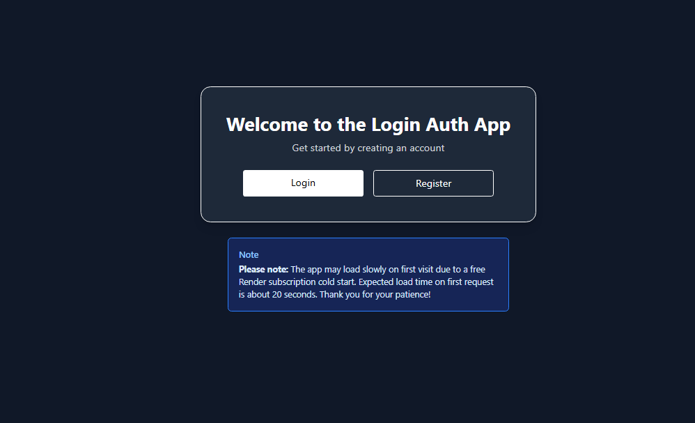

# 🔒 login-token-authentication
> A simple login app, made while practicing jwt token authentication. The app is meant to simulate a user creating an account and login and afterward, then the site displays the users username and id proving that the token auth was succesful.

A fullstack authentication demo featuring a secure backend API, a responsive frontend client..

## Tech Stack

- **Frontend:** React 19, React Router 8, TypeScript, Vite, Tailwind CSS, and TanStack Query
- **Backend:** Node.js 22, Express 5, and TypeScript
- **Authentication:** JWT tokens, HTTP cookies, bcrypt password hashing, and Zod validation
- **HTTP and logging:** Axios on the client, CORS on the server, and Pino logging

## Preview (Home + Succesful login)

