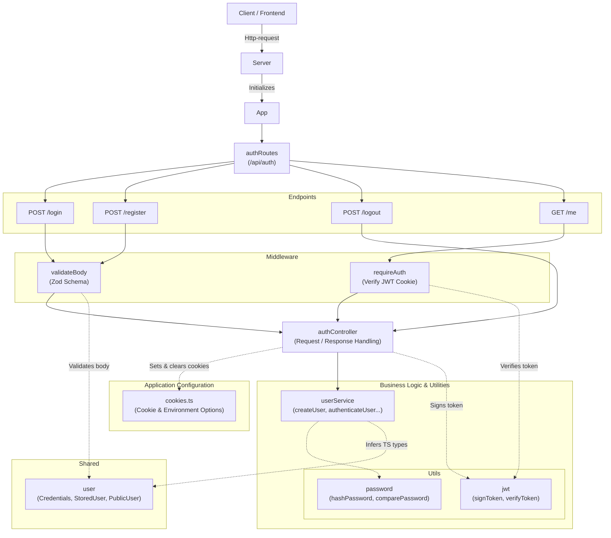

# Backend Component Architecture & Request Pipeline

```mermaid
%%{init: {'flowchart': {'wrappingWidth': 600}}}%%
graph TD
    Client["Client / Frontend"]
    Server
    App

    Client -->|Http-request| Server
    Server -->|Initializes| App

    Routes["authRoutes <br> (/api/auth)"]

    App --> Routes

    subgraph Endpoints
        Login["POST /login"]
        Register["POST /register"]
        Logout["POST /logout"]
        Me["GET /me"]
    end

    Routes --> Login
    Routes --> Register
    Routes --> Logout
    Routes --> Me

    subgraph Middleware
        ValidateBody["validateBody <br> (Zod Schema)"]
        RequireAuth["requireAuth <br> (Verify JWT Cookie)"]
    end

    Login --> ValidateBody
    Register --> ValidateBody
    Me --> RequireAuth

    AuthController["authController <br> (Request / Response Handling)"]

    ValidateBody --> AuthController
    Logout --> AuthController
    RequireAuth --> AuthController

    subgraph Configurations ["Application Configuration"]
        Cookies["cookies.ts <br> (Cookie & Environment Options)"]
    end

    AuthController -.->|Sets & clears cookies| Cookies

    subgraph Business_Logic["Business Logic & Utilities"]
        UserService["userService <br> (createUser, authenticateUser...)"]

        subgraph Utils
            Password["password <br> (hashPassword, comparePassword)"]
            JWT["jwt <br> (signToken, verifyToken)"]
        end
    end

    AuthController --> UserService
    UserService -.-> Password
    AuthController -.->|Signs token| JWT
    RequireAuth -.->|Verifies token| JWT

    subgraph Shared
        User["user <br> (Credentials, StoredUser, PublicUser)"]
    end

    ValidateBody -.->|Validates body| User
    UserService -.->|Infers TS types| User
```
